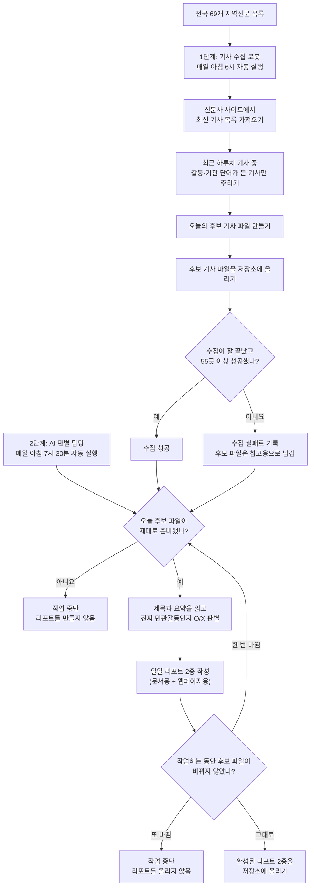

# bal-gul

전국 69개 지역신문에서 최근 기사를 모으고, 민간 주체와 정부·공공기관 사이의 실제 갈등을 매일 Markdown·HTML 리포트로 정리하는 파일 기반 자동화입니다.

- 기사 수집: GitHub Actions가 매일 06:00 KST에 실행
- 판별·리포트: ChatGPT 예약 작업이 매일 07:30 KST에 실행
- 저장: 내 GitHub 저장소에 JSON, Markdown, HTML 파일로 누적
- 별도 서버·DB·외부 AI API key: 없음

결과물은 [HTML 샘플](examples/sample-report.html)과 [Markdown 샘플](examples/sample-report.md)에서 먼저 볼 수 있습니다.

## 설치 전에 확인하세요

다음 항목이 모두 필요합니다.

- GitHub 계정
- 예약 작업을 사용할 수 있는 ChatGPT Plus 이상 계정
- ChatGPT Work에서 `Scheduled`와 `Plugins` 메뉴를 사용할 수 있는 환경
- 대상 저장소를 읽고 파일을 커밋할 수 있는 GitHub 플러그인

중요: 일반 ChatGPT의 검색용 GitHub 앱은 읽기 전용일 수 있습니다. 이 자동화는 매일 `reports/`에 두 파일을 커밋해야 하므로, GitHub 플러그인에 저장소 쓰기 도구가 보이지 않으면 설치를 완료할 수 없습니다. 자세한 확인법은 [SETUP.md](SETUP.md)에 있습니다.

## 3단계 설치

1. 이 페이지 위쪽의 **Use this template**을 눌러 내 저장소를 만듭니다. 기사·리포트가 공개되지 않도록 **Private**을 권장합니다.
2. 새 저장소의 **Actions**에서 **Collect article candidates**를 활성화하고 **Run workflow**를 한 번 실행합니다.
3. ChatGPT Work에 쓰기 가능한 GitHub 플러그인을 연결한 뒤 [SETUP_PROMPT.md](SETUP_PROMPT.md)의 프롬프트에 내 저장소 주소를 넣어 붙여넣습니다.

버튼 위치와 성공 확인 방법은 [상세 설치 가이드](SETUP.md)를 따라가세요. 터미널은 필요하지 않습니다.

## 전체 워크플로우

두 단계는 `data/candidates-YYYY-MM-DD.json`을 인계 파일로 사용합니다. 07:30 예약 작업은 당일 후보 파일과 06:00 Actions 성공 여부를 독립적으로 검증한 뒤에만 리포트를 만듭니다. GitHub Actions 예약 실행이 지연될 수 있으므로 수집 목표 시각과 90분 간격을 둡니다.

| 시각 | 실행 주체 | 입력 | 출력 | 성공 기준 |
|---|---|---|---|---|
| 06:00 KST | GitHub Actions | 신문사 목록과 수집 코드 | `data/candidates-YYYY-MM-DD.json` | 수집 성공 신문사 55곳 이상 |
| 07:30 KST | ChatGPT 예약 작업 | 당일 후보와 Actions 실행 이력 | `reports/YYYY-MM-DD.md`, `.html` | 준비 상태·최신성 검사 통과 |

## 매일 생기는 파일

- `data/candidates-YYYY-MM-DD.json`: 최근 기사 중 갈등·기관 키워드를 함께 포함한 1차 후보와 수집 통계
- `reports/YYYY-MM-DD.md`: 사람이 읽기 쉬운 Markdown 리포트
- `reports/YYYY-MM-DD.html`: 브라우저에서 보는 자체 완결형 리포트

후보가 준비되지 않았거나 Actions가 성공하지 않았으면 전날 데이터를 대신 쓰지 않고 그날 리포트를 만들지 않습니다. 같은 입력으로 이미 만든 리포트는 다시 커밋하지 않습니다.

## 내 주제에 맞게 바꾸기

갈등 키워드, 최종 판별 기준, 신문사 목록을 바꾸려면 [CUSTOMIZE.md](CUSTOMIZE.md)를 참고하세요. 날짜·준비 상태·출처 SHA·멱등성 규칙은 운영 안전장치이므로 변경하지 마세요.

## 알아둘 한계

- 저장소만 복사한다고 ChatGPT 예약 작업이 자동 등록되지는 않습니다. 최초 1회는 사용자가 ChatGPT에서 등록해야 합니다.
- GitHub 플러그인의 저장소 쓰기 권한이 없거나 예약 작업에서 사용할 수 없으면 리포트를 커밋할 수 없습니다.
- 비공개 저장소의 Actions 사용 시간은 저장소 소유자의 GitHub 요금제 한도에서 차감됩니다.
- 공개 저장소는 60일 동안 활동이 없으면 예약 workflow가 자동 비활성화될 수 있습니다.
- 외부 신문사 구조나 접속 상태가 바뀌면 일부 수집이 실패할 수 있습니다. 55곳 미만이면 리포트 생성을 막아 잘못된 결과를 방지합니다.

설치와 첫 실행 확인은 [SETUP.md](SETUP.md)에서 이어가세요.
